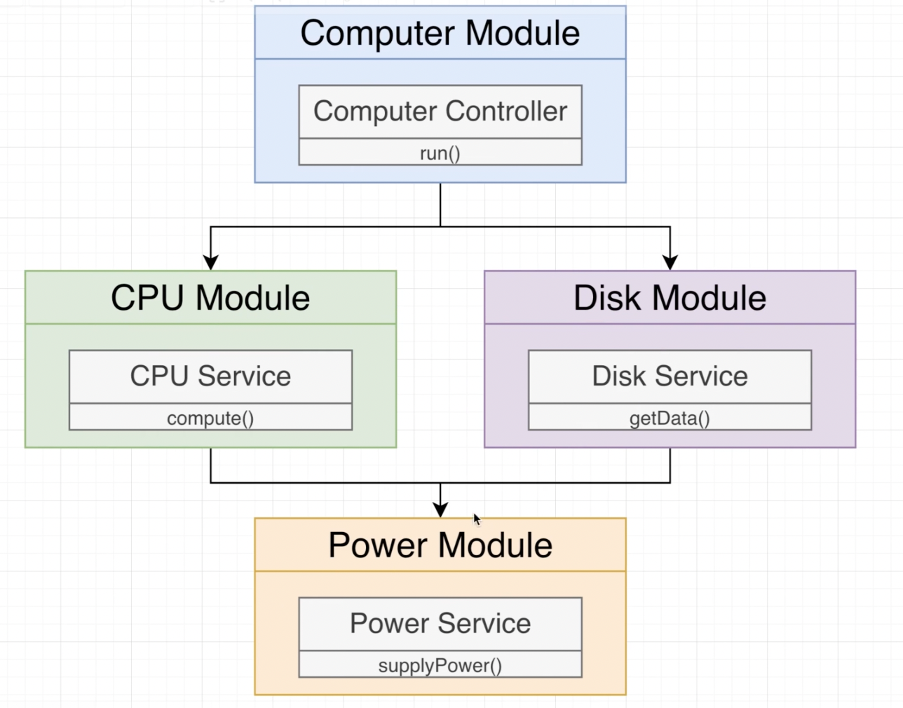
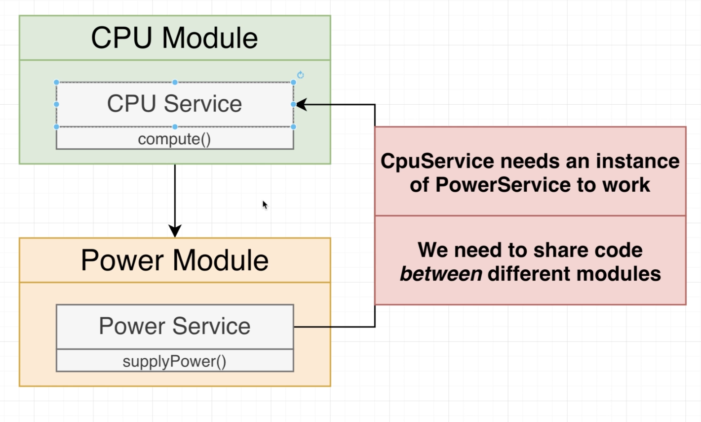
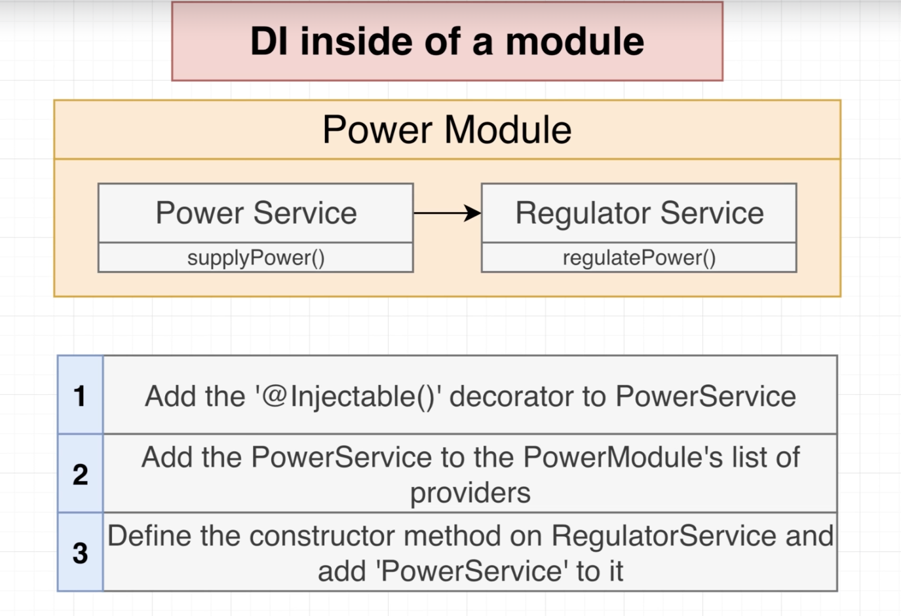

# Our App Structure



# Create App

```tsx
nest new di
```

# Create Module & Controllers

```tsx
nest g module computer
nest g module cpu
nest g module power
nest g module disk
nest g service cpu
nest g service power
nest g service disk
nest g controller computer
```

# Setting Up DI Between Modules

### Diagram



### DI inside of a module



# Power Module & CPU Module

### Power Module

- power.module.ts

```tsx
import { Module } from '@nestjs/common';
import { PowerService } from './power.service';

@Module({
  providers: [PowerService], // by default private, not available in other modules
  exports: [PowerService], // enable `export`
})
export class PowerModule {}
```

- power.service.ts

```tsx
import { Injectable } from '@nestjs/common';

@Injectable()
export class PowerService {
  supplyPower(watts: number) {
    console.log(`Supplying ${watts} worth of power.`);
  }
}
```

### CPU Module

- cpu.module.ts

```tsx
import { Module } from '@nestjs/common';
import { CpuService } from './cpu.service';
import { PowerModule } from 'src/power/power.module';

@Module({
  imports: [PowerModule], // Connecting CPU Module to Power Module
  providers: [CpuService],
})
export class CpuModule {}
```

- cpu.service.ts

```tsx
import { Injectable } from '@nestjs/common';
import { PowerService } from 'src/power/power.service';

@Injectable()
export class CpuService {
  constructor(private powerService: PowerService) {}
}
```

# Power Module & Disk Module

### Power Module

- power.module.ts

```tsx
import { Module } from '@nestjs/common';
import { PowerService } from './power.service';

@Module({
  providers: [PowerService], // by default private, not available in other modules
  exports: [PowerService], // enable `export`
})
export class PowerModule {}
```

- power.service.ts

```tsx
import { Injectable } from '@nestjs/common';

@Injectable()
export class PowerService {
  supplyPower(watts: number) {
    console.log(`Supplying ${watts} worth of power.`);
  }
}
```

### Disk Module

- disk.module.ts

```tsx
import { Module } from '@nestjs/common';
import { DiskService } from './disk.service';
import { PowerModule } from 'src/power/power.module';

@Module({
  imports: [PowerModule],
  providers: [DiskService],
})
export class DiskModule {}
```

- disk.service.ts

```tsx
import { Injectable } from '@nestjs/common';
import { PowerService } from 'src/power/power.service';

@Injectable()
export class DiskService {
  constructor(private powerService: PowerService) {}

  getData() {
    console.log('Drawing 20 watts of power from PowerService');
    this.powerService.supplyPower(20);
    return 'data!';
  }
}
```

# Computer Module & Disk Module & CPU Module

### CPU Module

- cpu.module.ts

```tsx
import { Module } from '@nestjs/common';
import { CpuService } from './cpu.service';
import { PowerModule } from 'src/power/power.module';

@Module({
  imports: [PowerModule], // Connecting CPU Module to Power Module
  providers: [CpuService],
  exports: [CpuService],
})
export class CpuModule {}
```

- cpu.service.ts

```tsx
import { Injectable } from '@nestjs/common';
import { PowerService } from 'src/power/power.service';

@Injectable()
export class CpuService {
  constructor(private powerService: PowerService) {}

  compute(a: number, b: number) {
    console.log('Drawing 10 watts of power from Power Service');
    this.powerService.supplyPower(10);
    return a + b;
  }
}
```

### Disk Module

- module.disk.ts

```tsx
import { Module } from '@nestjs/common';
import { DiskService } from './disk.service';
import { PowerModule } from 'src/power/power.module';

@Module({
  imports: [PowerModule],
  providers: [DiskService],
  exports: [DiskService],
})
export class DiskModule {}
```

- service.disk.ts

```tsx
import { Injectable } from '@nestjs/common';
import { PowerService } from 'src/power/power.service';

@Injectable()
export class DiskService {
  constructor(private powerService: PowerService) {}

  getData() {
    console.log('Drawing 20 watts of power from PowerService');
    this.powerService.supplyPower(20);
    return 'data!';
  }
}
```

### Computer Module

- module.computer.ts

```tsx
import { Module } from '@nestjs/common';
import { ComputerController } from './computer.controller';
import { CpuModule } from 'src/cpu/cpu.module';
import { DiskModule } from 'src/disk/disk.module';

@Module({
  imports: [CpuModule, DiskModule],
  controllers: [ComputerController],
})
export class ComputerModule {}
```

- controller.computer.ts

```tsx
import { Controller, Get } from '@nestjs/common';
import { CpuService } from 'src/cpu/cpu.service';
import { DiskService } from 'src/disk/disk.service';

@Controller('computer')
export class ComputerController {
  constructor(
    private cpuService: CpuService,
    private diskService: DiskService,
  ) {}

  @Get()
  run() {
    return [this.cpuService.compute(1, 2), this.diskService.getData()];
  }
}
```

# Start Project

```bash
npm run start:dev
```
